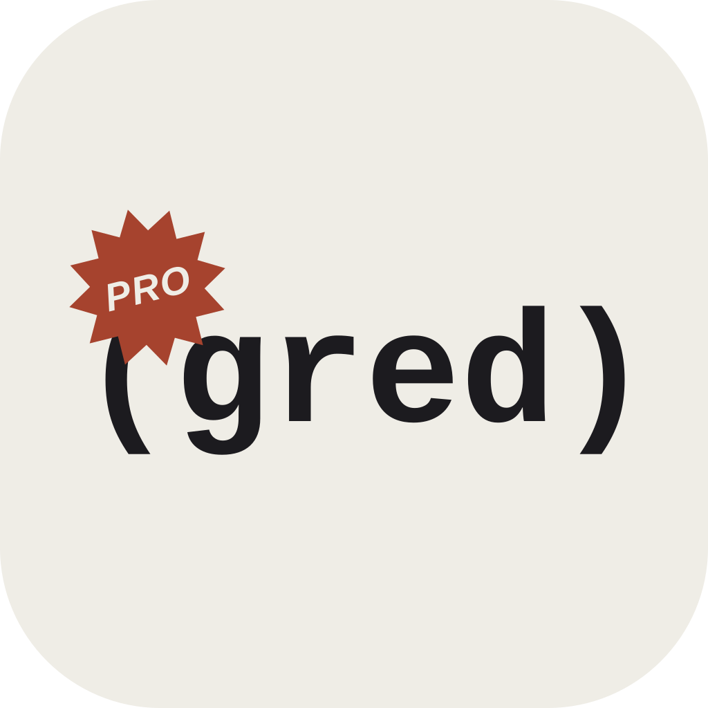
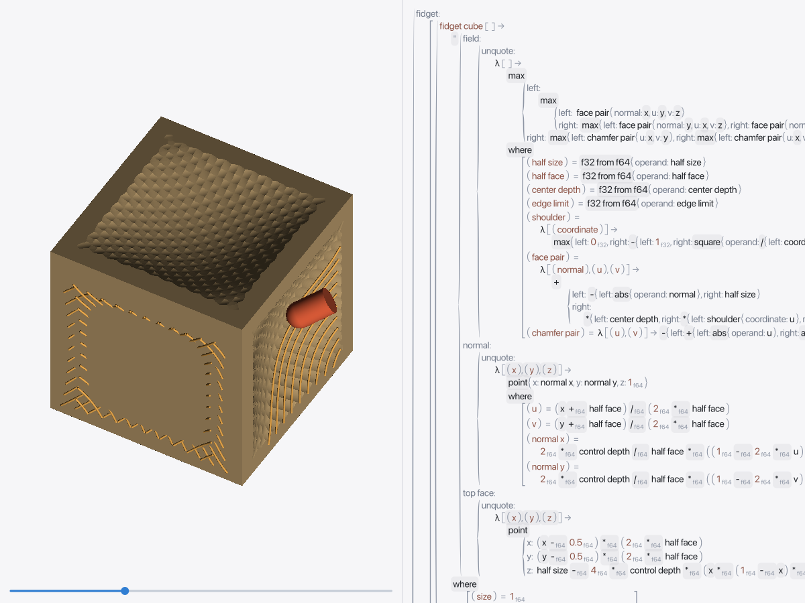
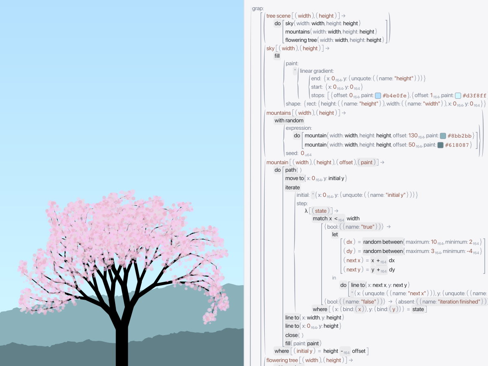

# Progred

Progred is an experimental **projectional programming environment**, currently
being developed toward interactive CAD/CAM. The aim is an
[*Inventing on Principle*](https://worrydream.com/InventingOnPrinciple/)-style
loop: change the program, see the result, and
work directly with both.

Instead of editing text that is parsed into a program, you edit structured data.
Different projections present that data as code, editable numbers, color pickers,
drawings, or 3D geometry. Those views share the same underlying document;
there is no canonical source-text representation to keep in sync.



*The CAM prototype during a tilted cutting pass, after the progressive implicit
renderer has finished its final refinement.*



*Our recreation of the tree demo from Bret Victor's
[Inventing on Principle](https://worrydream.com/InventingOnPrinciple/).
The original demo and the inspiration for this live-editing loop are his.
Both screenshots are headless editor captures, without operating-system window
chrome.*

This is a working prototype, not a finished CAD package. The editor, language,
and document conventions are evolving together. **CAM currently means toolpath
generation and stock-removal visualization—not machine-ready G-code, verified
clearance, or a safe machining plan.**

## What works today

- **Structural editing:** context-specific completions, editable names and
  literals, color swatches and pickers, two-dimensional number scrubbing,
  multiple panes and windows, and undo/redo.
- **Live drawings:** an editable recreation of the tree scene from Bret Victor's
  *Inventing on Principle*, with links between source code and drawing output.
- **Implicit CAD:** editable [Fidget](https://github.com/mkeeter/fidget) fields,
  colored scenes, orbit/zoom controls, and mesh or implicit rendering. Examples
  range from a torus and a gyroid to a parameterized, chamfered fidget cube.
- **Early CAM:** Grap-generated toolpaths, a playback slider, revolved cutter
  profiles, and stock subtraction using continuous fixed-orientation sweeps.
  The cube example separates top-and-side machining from a bottom operation;
  chamfer machining, tool changes, and machine output are still ahead.
- **Responsive expensive views:** explicit dependency-tracked computations,
  cancellable background work, and progressive rendering. The combined CAM
  viewport uses a mesh while implicit images refine in the background.

macOS is the primary development platform. There are also Linux and browser
hosts, plus an early native iPad port. They do not yet have feature or performance
parity: in particular, the browser currently runs expensive jobs synchronously.

## Try it

### macOS

Install stable Rust through `rustup` and Apple's command-line developer tools
(`xcode-select --install`), then:

```sh
git clone https://github.com/jbrownson/progred.git
cd progred
make sandbox-fetch
make run
```

The fetch step downloads the locked dependencies into an isolated Cargo home.
`make run` builds an optimized executable, packages and ad-hoc signs a macOS
App Sandbox bundle, and launches it. No paid Apple developer account is needed
for this local desktop build.

**Use the supplied build commands rather than ordinary `cargo build` or
`cargo run`.** Cargo dependencies can execute code during compilation; this
repository deliberately blocks accidental unsandboxed builds. See
[build security](docs/build-security.md) for the boundary and dependency-update
workflow.

For repeated editing and testing, use `make dev`. Ctrl+C rebuilds and restarts;
quitting the app also restarts it. Ctrl+\ ends the session. A failed build waits
for another Ctrl+C. Restarting this development loop discards unsaved changes.

### A first tour

Use the **Examples** menu to open a fresh example. On native macOS its shortcuts
are Command+1…9; the drawn menu on other hosts uses Ctrl+1…9.

| Start with | Shortcut | What to try |
| --- | --- | --- |
| Inventing on Principle Tree | 3 | Change a number and watch the drawing update |
| Fidget Cube | 8 | Orbit the model and edit its size, chamfer, or face depth |
| Toolpaths | 9 | Move the slider to inspect cuts into the stock |
| Sample / Grap Demo | 1 / 2 | Explore the data model and language constructs |

- Click numbers to edit them, or **Command-drag** to scrub: horizontal movement
  changes the value; moving upward makes adjustments coarser, downward finer.
  Use Ctrl instead outside native macOS.
- Drag a 3D view to orbit; scroll or pinch to zoom.
- In the tree drawing, Command-hover highlights linked source and can reveal
  it; Command-click selects it. Hovering the drawing calls in the source
  highlights their output without the modifier.
- Click an empty location to choose a completion. `…` expands the suggestions
  to the full vocabulary. The **Raw** view exposes the underlying structure.

Examples replace the current document after the desktop's unsaved-changes
confirmation. New Document does the same; New Window opens another window.
These replace-in-place shortcuts are development conveniences.

See the [example guide](examples/README.md) for all nine documents, rendering
options, and the geometry behind them. Heavy CAM views are best tried natively;
high-quality implicit refinement can take time and still has rendering artifacts.

### Browser, Linux, and iPad

To build the browser version **on macOS**, use the same dependency-fetch step,
install the `wasm32-unknown-unknown` target for stable Rust, and have a
`wasm-bindgen` CLI matching the version in `Cargo.lock` available on `PATH`.
Then run:

```sh
make serve-web
```

Open `http://localhost:8080`, or this machine's LAN address from another device
on the same network. The development server listens on all network interfaces.

On Linux, `make run` uses the native launcher and performs a regular locked
Cargo build; **the Linux build is not sandboxed**. The macOS `sandbox-*` commands
do not apply there.

The native iPad host is `ios/Progred.xcodeproj`; its Xcode build includes the Rust
build. It remains a feasibility port with input and document-management gaps.
See [platform notes](docs/platforms.md) before trying it. visionOS is deferred,
not an implemented port.

## How it fits together

The design favors small constructs and reusable combinators: a composition
should remain an ordinary input to further composition. Native implementations
can lower those abstractions without changing the data or language semantics.

- **GID** is the data substrate: cell references, blobs, lists, and records.
  Cell identity is independent of names. Libraries add open conventions for
  text, numbers, colors, geometry, and other domains.
- **Grap** is a small language embedded in GID. Functions consume and produce
  GID values, with Rust functions providing primitive operations. Grap can
  generate Fidget geometry or emit toolpaths; neither domain is built into its
  evaluator.
- **Projections** compose partial views above one total structural fallback.
  They choose how to present and edit a value in context. Unexpected data can
  fall back to structural editing instead of disappearing.
- **Puri and layout** separate pure widget descriptions from box placement.
  Settled geometry feeds hover, then independent painting and input handlers.
  Drawing targets Vello or Canvas2D directly; the same interface can record
  output for tests and headless screenshots.
- **Incremental computations** retain explicitly selected expensive work,
  tracking reads and nested computations. Background jobs and progressive
  results use that graph; the UI does not maintain a second retained widget tree.

The checked-in `.gid` files use a temporary text bridge for Git, debugging, and
tooling. The logical data model is already structural; its native binary storage
format is future work. See [GID](docs/gid.md) and [the text bridge](docs/gid-text.md).

## Repository layout

- [`gid/`](gid/) — values, cells, documents, and positions
- [`grap/`](grap/) — evaluator
- [`incremental/`](incremental/) — dependency graph and background computations
- [`progred/`](progred/) — editor application; libraries and projections live in
  [`progred/src/libraries/`](progred/src/libraries/), layout in
  [`progred/src/display/`](progred/src/display/)
- [`ui/`](ui/) — Puri, reusable widgets, measurement, and drawing backends
- [`examples/`](examples/) — bundled documents
- [`docs/`](docs/) — current references, experiments, and deferred work

## Development and further reading

On macOS:

```sh
make sandbox-check
make sandbox-test
```

Start with [the motivation](MOTIVATION.md), then the
[documentation index](docs/README.md). More focused references cover
[the editor model](docs/model.md), [Grap and projections](docs/projections.md),
[Puri](docs/puri.md), [incremental work](docs/incremental.md), and
[toolpaths](docs/toolpaths.md). Review the
[release checklist](docs/release-checklist.md) before distributing builds.

Earlier TypeScript, Swift, egui, Haskell, and nested Linebender prototypes are
preserved at `archive/pre-root-promotion`; `archive/multi-prototype` retains an
earlier milestone. Their design notes are in [history](docs/history/).
